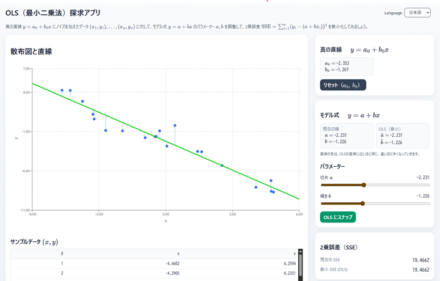

# OLS（最小二乗法）探求アプリ

[English](README_en.md) &nbsp;&nbsp;&nbsp;&nbsp;&nbsp; [日本語](README_ja.md)

---

## 概要

[](https://tanaken-basis.github.io/ols-playground/)

この Web アプリは **単回帰分析の最小2乗法** を視覚的に体感できる学習ツールです。  
散布図と直線を操作しながら、回帰直線がどのように「二乗誤差（SSE）」を最小化するかを理解できます。  

[プログラムの使用例(Webアプリ)](https://tanaken-basis.github.io/ols-playground/)で実際の挙動を確かめることができますのでご覧ください。

---

## 🚀 機能
- 真の直線 $ y = a_0 + b_0 x $ にノイズを加えたサンプルデータを生成
- ユーザーがパラメータ $ a, b $ をスライダーで調整可能
- SSE（二乗誤差）がリアルタイムで表示され、OLS に近づくと直線の色が変化
- 真の直線の表示／残差の表示／軸固定などをトグルで切替可能
- データ数・ノイズ強度を変更可能
- サンプルデータのテーブル表示

---

## 🛠️ インストールと実行方法

### インストールの前に

ローカルマシンでのインストールと実行には、[Node.js](https://nodejs.org/)が必要です。

### インストール

まず、リポジトリをローカルマシンにクローンします。
ターミナルで以下のように実行するか、または、[ここ](https://github.com/tanaken-basis/ols-playground)からzipファイルをダウンロードして展開します。
```sh
git clone https://github.com/tanaken-basis/ols-playground.git
```

次に、プロジェクトのディレクトリに移動します。
```sh
cd ols-playground
```

ライブラリのインストールをします。
```sh
npm install
```

### 実行方法

ターミナルで以下のように入力して、ブラウザで [http://localhost:5173](http://localhost:5173) （ポート番号は5173とは違う場合もあります）にアクセスするとWebアプリが起動します。
```sh
npm start
```

---