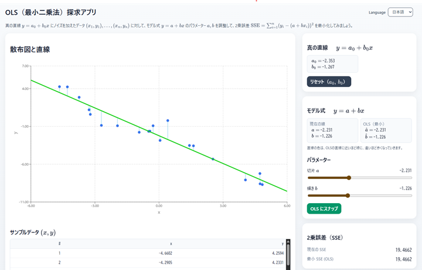
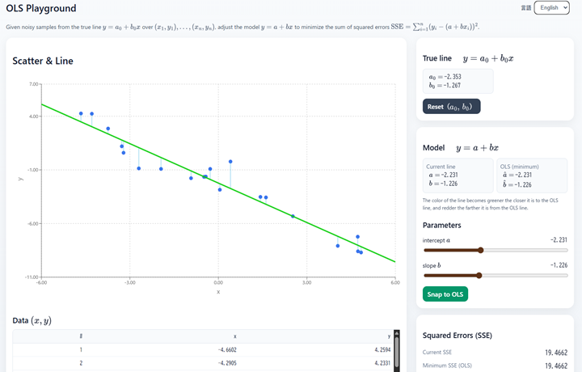

#### [English](#english) | [日本語](#日本語)

## 日本語
# OLS（最小二乗法）探求アプリ
## 概要

[](https://tanaken-basis.github.io/ols-playground/)

この Web アプリは **単回帰分析の最小2乗法** を視覚的に体感できる学習ツールです。  
散布図と直線を操作しながら、回帰直線がどのように「二乗誤差（SSE）」を最小化するかを理解できます。  

[プログラムの使用例(Webアプリ)](https://tanaken-basis.github.io/ols-playground/) で実際の挙動を確かめることができますのでご覧ください。

---

## 🚀 機能
- 真の直線 $ y = a_0 + b_0 x $ にノイズを加えたサンプルデータを生成
- ユーザーがパラメータ $ a, b $ をスライダーで調整可能
- SSE（二乗誤差）がリアルタイムで表示され、OLS に近づくと直線の色が変化
- 真の直線の表示／残差の表示／軸固定などをトグルで切替可能
- データ数・ノイズ強度を変更可能
- サンプルデータのテーブル表示

---

## 🛠️ インストールと実行方法

### インストールの前に

ローカルマシンでのインストールと実行には、[Node.js](https://nodejs.org/)が必要です。

### インストール

まず、リポジトリをローカルマシンにクローンします。
ターミナルで以下のように実行するか、または、[ここ](https://github.com/tanaken-basis/ols-playground)からzipファイルをダウンロードして展開します。
```sh
git clone https://github.com/tanaken-basis/ols-playground.git
```

次に、プロジェクトのディレクトリに移動します。
```sh
cd ols-playground
```

ライブラリのインストールをします。
```sh
npm install
```

### 実行方法

ターミナルで以下のように入力して、ブラウザで [http://localhost:5173](http://localhost:5173) （ポート番号は5173とは違う場合もあります）にアクセスするとWebアプリが起動します。
```sh
npm start
```

---
---
#### [English](#english) | [日本語](#日本語)
## English
# OLS Playground — Interactive Least Squares Regression

[English](README_en.md) &nbsp;&nbsp;&nbsp;&nbsp;&nbsp; [日本語 (Japanese)](README_ja.md)

---

## Overview

[](https://tanaken-basis.github.io/ols-playground/)

This web app is a **learning tool for simple linear regression with Ordinary Least Squares (OLS)**.  
It allows you to interactively adjust a regression line and observe how it minimizes the **Sum of Squared Errors (SSE)**.

Check out the [example of program usage](https://tanaken-basis.github.io/ols-playground/) to see how it works.

---

## 🚀 Features
- Generates noisy data from a true line $ y = a_0 + b_0 x $
- Adjustable parameters $ a, b $ via sliders
- SSE displayed in real-time, line color changes based on closeness to OLS
- Toggle options: show true line, show residuals, fix axes
- Adjustable sample size and noise strength
- Table view of generated data

---

## 🛠️ Installation and Execution

### Prerequisites
Before installing and running the program on your local machine, make sure you have [Node.js](https://nodejs.org/) installed.

### Installation
First, clone the repository to your local machine. You can do this by running the following command in your terminal or by downloading the zip file from [here](https://github.com/tanaken-basis/ols-playground):
```sh
git clone https://github.com/tanaken-basis/ols-playground.git
```

Navigate to the project directory:
```sh
cd ols-playground
```

Install the required libraries:
```sh
npm install
```

### Execution
To run the program, enter the following command in your terminal. Access the web app by opening your browser and navigating to http://localhost:5173/ (note that the port number may differ):
```sh
npm start
```
