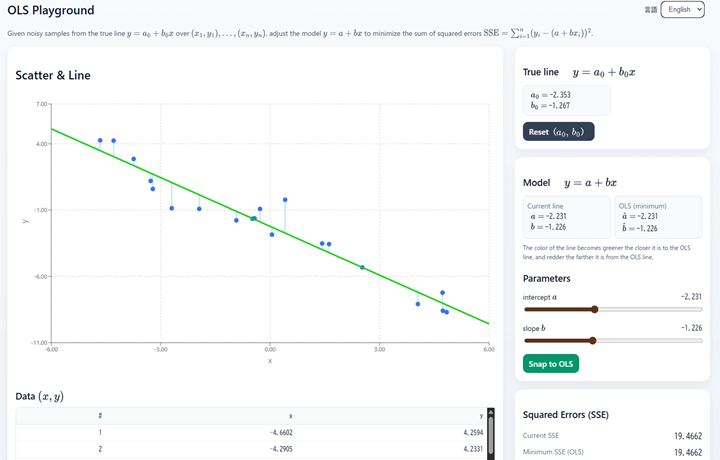

# OLS Playground — Interactive Least Squares Regression

[English](README_en.md) &nbsp;&nbsp;&nbsp;&nbsp;&nbsp; [日本語 (Japanese)](README_ja.md)

---

## Overview

[](https://tanaken-basis.github.io/ols-playground/)

This web app is a **learning tool for simple linear regression with Ordinary Least Squares (OLS)**.  
It allows you to interactively adjust a regression line and observe how it minimizes the **Sum of Squared Errors (SSE)**.

Check out the [example of program usage](https://tanaken-basis.github.io/ols-playground/) to see how it works.

---

## 🚀 Features
- Generates noisy data from a true line $` y = a_0 + b_0 x `$
- Adjustable parameters $` a, b `$ via sliders
- SSE displayed in real-time, line color changes based on closeness to OLS
- Toggle options: show true line, show residuals, fix axes
- Adjustable sample size and noise strength
- Table view of generated data

---

## 🛠️ Installation and Execution

### Prerequisites
Before installing and running the program on your local machine, make sure you have [Node.js](https://nodejs.org/) installed.

### Installation
First, clone the repository to your local machine. You can do this by running the following command in your terminal or by downloading the zip file from [here](https://github.com/tanaken-basis/ols-playground):
```sh
git clone https://github.com/tanaken-basis/ols-playground.git
```

Navigate to the project directory:
```sh
cd ols-playground
```

Install the required libraries:
```sh
npm install
```

### Execution
To run the program, enter the following command in your terminal. Access the web app by opening your browser and navigating to http://localhost:5173/ (note that the port number may differ):
```sh
npm start
```

---
